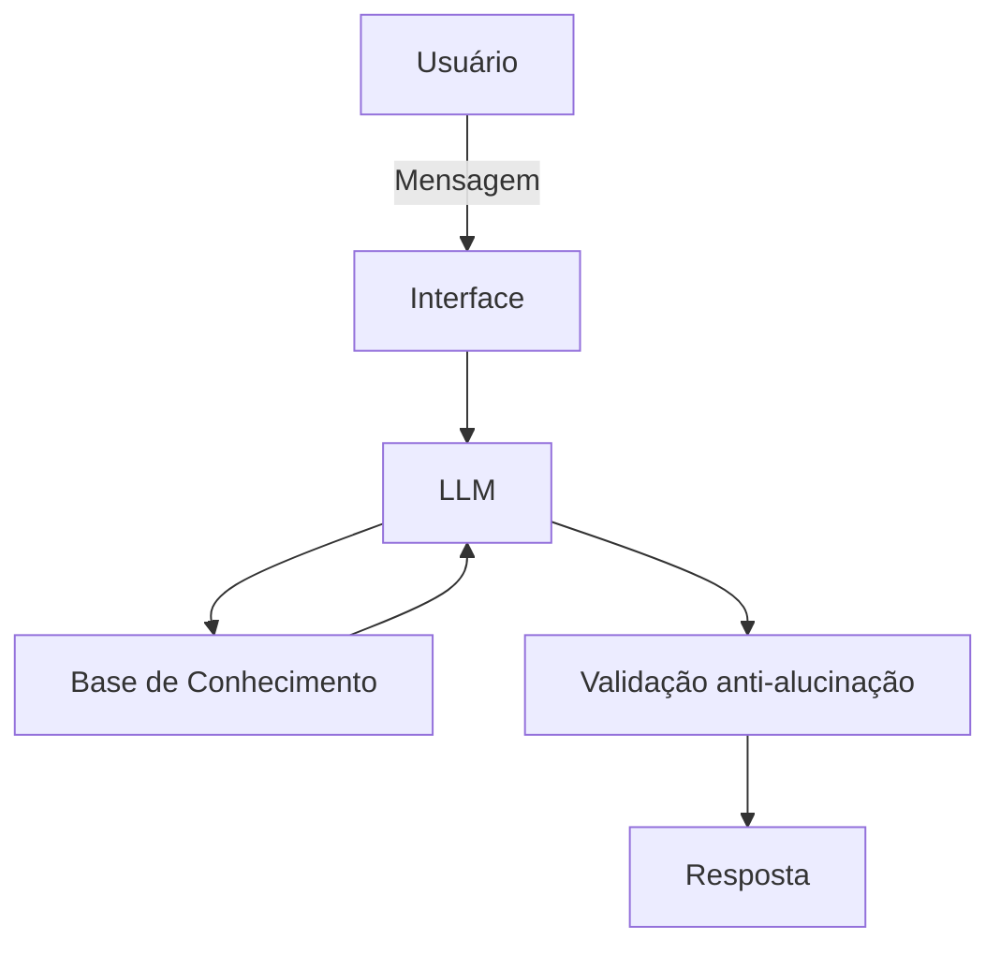

# 🎯 Radar — seu educador financeiro

Agente de IA Generativa criado para o desafio **"Agente Financeiro Inteligente"** (DIO), com foco em **educação financeira comportamental**: identificar gastos impulsivos e microtransações invisíveis e intervir no momento certo, antes que o orçamento seja comprometido.

> ⚠️ Radar não recomenda investimentos nem acessa dados bancários reais. Ele educa, alerta e orienta com base em dados fictícios.

---

## 💡 O problema

Grande parte da perda de controle financeiro não vem de grandes decisões, mas de **microtransações invisíveis** e **gastos impulsivos** disparados por gatilhos emocionais e situacionais (fim de semana, delivery à noite, compras por impulso).

## 🧠 A solução

O Radar combina **regras estatísticas** (limites de gasto por categoria/período) com **IA generativa** para interpretar o contexto de cada transação — horário, recorrência, intenção — e agir de forma **proativa**, não apenas reativa.

**Personalidade:** observador, adaptável e direto ao ponto. Tom amigável no dia a dia, mas assertivo e sério ao alertar sobre um gatilho de gasto.

---

## 🏗️ Arquitetura



## 📊 Base de conhecimento

Dados mockados usados para contextualizar cada resposta do agente:

| Arquivo | Uso no Radar |
|---|---|
| `data/transacoes.csv` | Detecta padrões e picos de microtransações em tempo real |
| `data/historico_atendimento.csv` | Mantém consistência do acompanhamento ao longo do tempo |
| `data/perfil_investidor.json` | Ajusta o tom da intervenção conforme o perfil do cliente |
| `data/produtos_financeiros.json` | Mapeia gatilhos comportamentais (horários, dias, categorias de risco) |

## 💬 Exemplo de interação

> **Usuário:** Vou pedir uma pizza para relaxar hoje.
>
> **Radar:** João, alerta ligado! Esse seria o seu terceiro delivery da semana. Esses R$ 120,00 vão te afastar diretamente da sua meta da Reserva de Emergência. Recomendo cancelar esse pedido e transferir esse valor agora mesmo para o seu Cofre Virtual Programado. Vamos manter o foco no seu objetivo principal?

Mais exemplos e *edge cases* (pergunta fora do escopo, pedido de dado sensível, recomendação sem contexto) em [`docs/03-prompts.md`](./docs/03-prompts.md).

## 🔒 Segurança e limites

- Responde apenas com base nos dados fornecidos
- Admite quando não sabe algo, em vez de inventar
- **Não** recomenda investimentos específicos
- **Não** acessa dados bancários sensíveis
- **Não** substitui um profissional certificado

## 📈 Avaliação

O agente foi validado com testes estruturados (assertividade, segurança contra alucinação e coerência com o perfil do cliente) — detalhes em [`docs/04-metricas.md`](./docs/04-metricas.md).

## 🎥 Demonstração

Pitch de 3 minutos com o agente em funcionamento: **[streamable.com/1669xt](https://streamable.com/1669xt)**

---

## 📁 Estrutura do repositório

```
├── docs/                          # Documentação completa da solução
│   ├── 01-documentacao-agente.md  # Caso de uso, persona, arquitetura e segurança
│   ├── 02-base-conhecimento.md    # Estratégia de dados
│   ├── 03-prompts.md              # System prompt, exemplos e edge cases
│   ├── 04-metricas.md             # Avaliação e resultados dos testes
│   └── 05-pitch.md                # Roteiro e link do pitch
├── data/                          # Dados mockados que alimentam o Radar
├── src/
│   └── app.py                     # Aplicação Streamlit + Ollama (código do Radar)
└── assets/                        # Roteiro original do desafio
```

## 🚀 Como executar

O Radar é um chat em **Streamlit** que roda o modelo **Llama 3.1 localmente via Ollama**, usando os dados de `data/` como contexto de cada resposta.

```bash
# 1. Instale as dependências
pip install streamlit pandas requests

# 2. Baixe e rode o modelo via Ollama
ollama run llama3.1

# 3. Inicie a aplicação
streamlit run src/app.py
```

**O que a interface oferece:**
- Painel lateral com o perfil do cliente e progresso da reserva de emergência
- Chat contínuo com streaming de resposta (word-by-word)
- Sugestões rápidas de perguntas (chips)
- Contexto do cliente (perfil, transações, histórico e produtos) montado automaticamente a partir dos arquivos em `data/` e injetado no *system prompt* a cada interação

## 📚 Documentação completa

| Etapa | Link |
|---|---|
| 1. Documentação do agente | [`docs/01-documentacao-agente.md`](./docs/01-documentacao-agente.md) |
| 2. Base de conhecimento | [`docs/02-base-conhecimento.md`](./docs/02-base-conhecimento.md) |
| 3. Prompts | [`docs/03-prompts.md`](./docs/03-prompts.md) |
| 4. Métricas | [`docs/04-metricas.md`](./docs/04-metricas.md) |
| 5. Pitch | [`docs/05-pitch.md`](./docs/05-pitch.md) |

---

*Desafio desenvolvido para a trilha da [DIO](https://www.dio.me/).*
