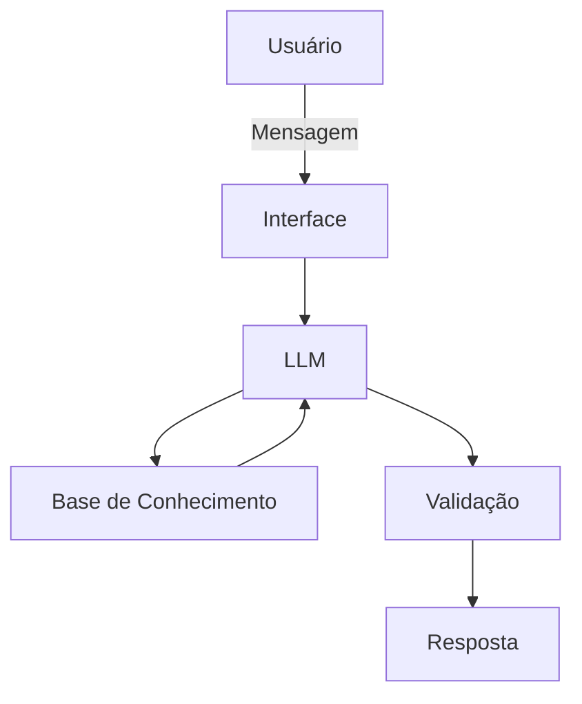

# Documentação do Agente

## Caso de Uso

### Problema
> Qual problema financeiro seu agente resolve?

A perda de controle sobre microtransações invisíveis e gastos impulsivos gerados por gatilhos emocionais ou situacionais.

### Solução
> Como o agente resolve esse problema de forma proativa?

O agente integra sistemas clássicos baseados em regras (para estabelecer limites estatísticos de gastos) com modelos gerativos e Processamento de Linguagem Natural (PLN) para analisar o contexto semântico e temporal de cada transação (horário, recorrência, intenção de compra).

### Público-Alvo
> Quem vai usar esse agente?

Usuários que reconhecem seus próprios padrões de descontrole e buscam uma ferramenta de reeducação financeira baseada em intervenção ativa e em tempo real.

---

## Persona e Tom de Voz

### Nome do Agente
Radar

### Personalidade
> Como o agente se comporta? (ex: consultivo, direto, educativo)

Proativo, observador e adaptável.

### Tom de Comunicação
> Formal, informal, técnico, acessível?

Acessível, direto e voltado para a ação. Evita jargões financeiros complexos e foca na mudança de hábitos. Utiliza uma linguagem amigável e encorajadora na maior parte do tempo, mas adota um tom sério, assertivo e objetivo ao emitir alertas de gatilhos de gastos.

### Exemplos de Linguagem
- Saudação: [ex: "Olá! Aqui é o Radar. Vi que o fim de semana está chegando, vamos revisar como está o fôlego do seu orçamento para hoje?"]
- Confirmação: [ex: "Entendi! Deixa eu verificar isso para você."]
- Erro/Limitação: [ex: "Ainda não tenho acesso a esse histórico tão antigo, mas posso analisar seu comportamento de gastos dos últimos 90 dias. Vamos focar nisso?"]

---

## Arquitetura

### Diagrama

### Componentes

| Componente | Descrição |
|------------|-----------|
| Interface | [ex: Chatbot em Streamlit] |
| LLM | [ex: Gemini via API] |
| Base de Conhecimento | [ex: JSON/CSV com dados do cliente] |
| Validação | [ex: Checagem de alucinações] |

---

## Segurança e Anti-Alucinação

### Estratégias Adotadas

- [x] [ex: Agente só responde com base nos dados fornecidos]
- [x] [ex: Respostas incluem fonte da informação]
- [x] [ex: Quando não sabe, admite e redireciona]
- [x] [ex: Foco apenas em educar, não em acoselhar]

### Limitações Declaradas
> O que o agente NÃO faz?

- Não faz recomendação de investimento
- Não acessa dados bancários sensíveis
- Não substitui um profissional certificado
